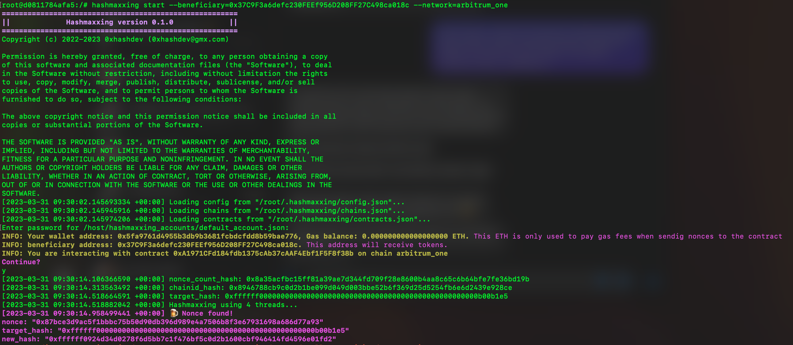

# hashmaxxing

## Requirements
This repo requires `docker` and `git` installed.

## Installation

1. Clone repo: </br>
   `git clone https://github.com/0xhashdev/hashmaxxing.git && cd hashmaxxing` 
2. Build production container: Either run </br>
    `./build-image-prod.sh` </br>
    or </br>
    ```
    docker build \
    --build-arg USRNM=$(whoami) \
    --build-arg USRUID=$(id -u) \
    --build-arg USRGID=$(id -g) \
    -t hashmaxxing:latest \
    -f Dockerfile.prod .
    ```
3. Create directory on your host machine for the accounts: </br> `mkdir $HOME/hashmaxxing_accounts`
4. Run the image and mount accounts dir: </br> `docker run -it -v $HOME/hashmaxxing_accounts:/host/hashmaxxing_accounts/ hashmaxxing:latest`
5. Inside the docker run the following command to create a new address: </br> `hashmaxxing generate-address --output $HASHMAXXING_ACCOUNTS_PATH/default_account.json` </br> This will create a new account. You will be prompted to set up a password for this account: </br> 
```
Creating new address and saving key to "/host/hashmaxxing_accounts/default_account.json"...
Password:
Confirm password:
Created new wallet with address 0x4872368f72af6fa81c0e1919feadcbc7631aa1e9
```
**IMPORTANT:** The environment variable `$HASHMAXXING_ACCOUNTS_PATH` inside the container should always point to a **mounted directory**. This way, the account private key will exist on your host system and will not be lost, when you stop the container. If you create an account that is saved only inside the container it will be lost, when you stop the container. </br>
**Be careful:** If you forget your password or delete the json file, there is absolutely no way to recover this account. We recommend storing a small value on this account, as this will only be used to pay for gas fees, when you submit a nonce to the smart contract.

## Usage

Once installed, you can use the tool by starting the container and working inside it. 

1. Start the container, if not started yet: `docker run -it -v $HOME/hashmaxxing_accounts:/host/hashmaxxing_accounts/ hashmaxxing:latest` </br>
2. Start hashmaxxing a.k.a. mining by running the following command inside docker: `hashmaxxing start --beneficiary=<your address>` </br> **note:** we recommend the beneficary address to be different from the address you generated at installation, preferably a cold wallet address or your Metamask address.

To learn more about possible flags and command line arguments, run `hashmaxxing --help` or `hashmaxxing start --help`.

**Note:** you can try running the software using testnet ETH and testnet contracts by  specifying `--network=ethereum_goerli` or `--network=arbitrum_goerli`.

After a successful installation, when running the program, you should see something like this:
</br>

# Important Addresses

### Ethereum Mainnet
Token: [0x445164D9E038e1dae0989E4b6Ac745B78d26F181](https://etherscan.io/address/0x445164D9E038e1dae0989E4b6Ac745B78d26F181)

Gateway: [0x04bdBE0Bc4EdB62eA12070435ee67782bA292948](https://etherscan.io/address/0x04bdBE0Bc4EdB62eA12070435ee67782bA292948)

### Arbitrum One
Token: [0x445164D9E038e1dae0989E4b6Ac745B78d26F181](https://arbiscan.io/address/0x445164D9E038e1dae0989E4b6Ac745B78d26F181)

Gateway: [0x7040876a31b4767fEA173E5cc04010f2CFB89Ff0](https://arbiscan.io/address/0x7040876a31b4767fEA173E5cc04010f2CFB89Ff0)

### Ethereum Goerli
Token: [0x72680c4D435d276c4bF56f82b6471D0A36cc0B20](https://goerli.etherscan.io/address/0x72680c4D435d276c4bF56f82b6471D0A36cc0B20)

Gateway: [0x1b50aA79dA53a037f3545C2C275F33d0A94FcFcf](https://goerli.etherscan.io/address/0x1b50aA79dA53a037f3545C2C275F33d0A94FcFcf)

### Arbitrum Goerli
Token: [0xD38851882Ce00F259c63eC80609f18F1C7a8D07D](https://goerli.arbiscan.io/address/0xD38851882Ce00F259c63eC80609f18F1C7a8D07D)

Gateway: [0x4c6Dc6cC8D78c74c36860902c2E9bf37b1Ed188D](https://goerli.arbiscan.io/address/0x4c6Dc6cC8D78c74c36860902c2E9bf37b1Ed188D)

